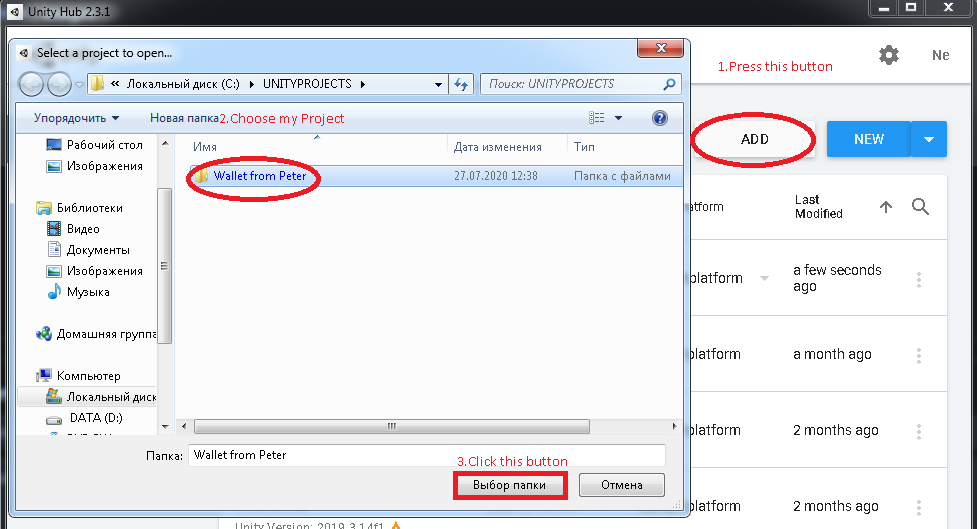
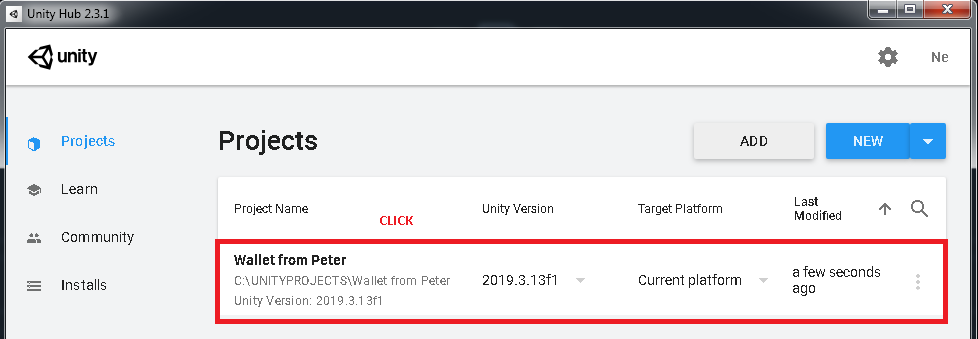

# Wallet-From-Peter
Unity Project
### Build or Installation project
##### Step 1:Download Unity 2019.3.13
[Link](https://unity3d.com/unity/whats-new/2019.3.13)
##### Step 2: Download this project via ZIP
You may know how to do this
##### Step 3: Unpack this project to any folder
Example: C:/Users/user/Documents/UnityProjects/WalletFromPeter/
##### Step 4: Choose Project in Unity Hub

##### Step 5: Choose Wallet From Unity Hub

##### Step 6: Enjoy my project
